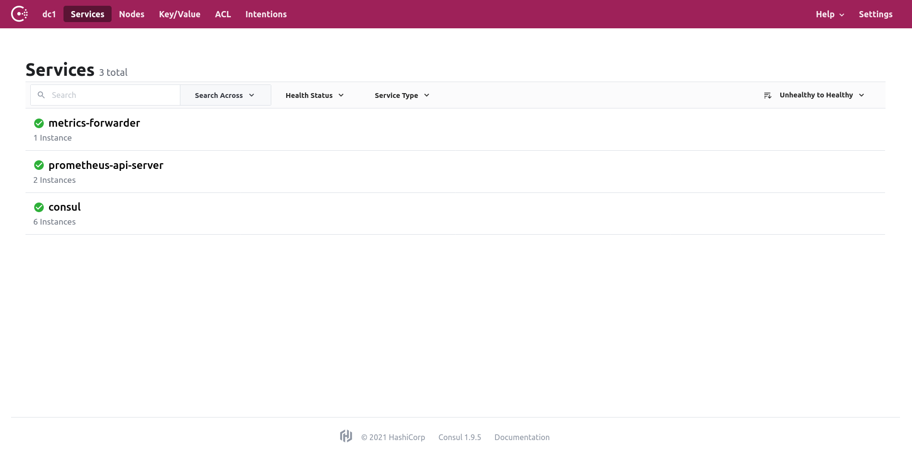

# Prometheus gRPC Exporter Demo

## Architecture


## Deployment

### Local Setup
**Step 1.** Install external tooling:
```shell script
make install
```
**Step 2.** Setup project for local testing (go code lint, proto file lint, builds all needed binaries):
```shell script
make all
```
---
NOTE
> All binaries can be found in `<project_root>/bin` directory.
> Use `make clean` to delete old binaries.
--- 

Other useful commands:
```shell script
# Builds prometheus-api-server.
make build-server 

# Builds prometheus-grpc-client.
make build-client

# Builds prometheus-remote-receiver.
make build-remote-receiver

# Regenerates Protocol Buffers and gRPC stubs.
make generate
```

### Docker-compose Setup

**Step 1.** Run `docker-compose` to setup everything:
```shell script
docker-compose up -d
```
**Step 2.** Open http://localhost:8500 to monitor Consul web UI.


**Step 3.** Open http://localhost:9998 to monitor Fabio web UI.


**Step 4.** Check the logs of `prometheus-grpc-client` in order to see Prometheus metrics printed to stdout:

```shell script
docker-compose logs --follow prometheus-grpc-client
``` 

## License

The content of this project itself is licensed under the MIT License.

Enjoy :wink: