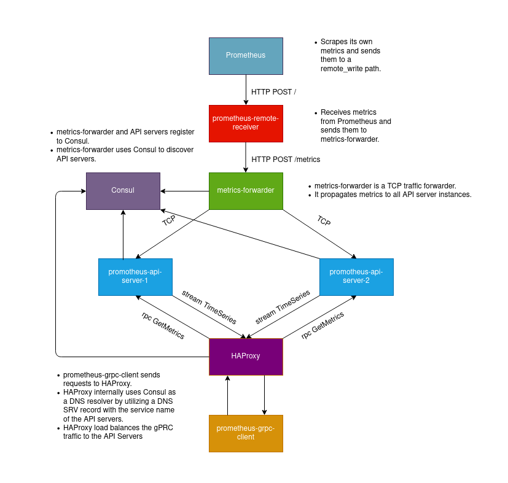

# Prometheus gRPC Exporter Demo

## Architecture


## Components

### External Prometheus

- Standard Prometheus instance configured to scrape it own metrics.

### prometheus-remote-receiver

- Application serving as the `remote-write` path for Prometheus.
- Gathers dumped metrics from Prometheus and forwards them to 
  `metrics-forwarder` service.  

### metrics-forwarder

- TCP forwarder service.
- Receives scraped Prometheus metrics from `prometheus-remote-receiver` 
  via TCP and forwards them to all API server instances via TCP at the 
  same time.
  
### prometheus-api-server

- Main service that receives scraped Prometheus metrics from `metrics-forwarder` 
  via TCP, processes them and stores them to timestamped files with a `latest` 
  symlink attached to the latest one.
- This service has two instances that are both identical, but with separate 
  storages. 
  
## HAProxy

- HAProxy serves here as a gRPC load balancer that distributes traffic from 
  `prometheus-grpc-client` between all instances of `prometheus-api-server`.
- Internally it uses Consul as a DNS resolver by utilizing the SRV DNS record.

## prometheus-grpc-client

- A gRPC client for `prometheus-api-server` which is also a gRPC server.
- Calls HAProxy which forwards to one of the API server instances.
- Performs a `GetMetrics` RPC call which returns a stream of Prometheus `TimeSeries`.
  
## Consul

- External component used as client side service discovery.
- `metrics-forwarder` and all instances of `prometheus-api-server` are registered 
to Consul.
- `HAProxy` uses it as a DNS resolver.


## Deployment

### Local Setup
**Step 1.** Install external tooling:
```shell script
make install
```
**Step 2.** Setup project for local testing (go code lint, proto file lint, builds all needed binaries):
```shell script
make all
```
---
NOTE
> All binaries can be found in `<project_root>/bin` directory.
> Use `make clean` to delete old binaries.
--- 

Other useful commands:
```shell script
# Builds prometheus-api-server.
make build-server 

# Builds prometheus-grpc-client.
make build-client

# Builds prometheus-remote-receiver.
make build-remote-receiver

# Builds metrics-forwarder.
make build-forwarder

# Regenerates Protocol Buffers and gRPC stubs.
make generate
```

### Docker-compose Setup

**Step 1.** Run `docker-compose` to setup everything:
```shell script
docker-compose up -d
```
**Step 2.** Open http://localhost:8500 to monitor Consul web UI.


**Step 3.** Check the logs of `prometheus-grpc-client` in order to see Prometheus metrics printed to stdout:

```shell script
docker-compose logs --follow prometheus-grpc-client
``` 

## License

The content of this project itself is licensed under the MIT License.

Enjoy :wink: